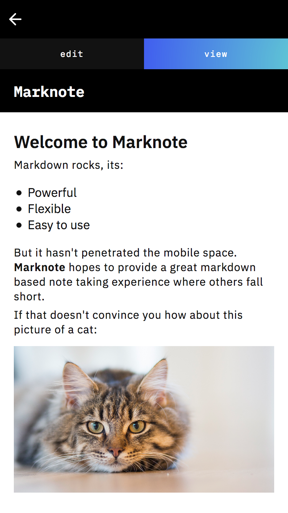

# Marknote

A mobile first note taking experience harnessing the power of markdown. Notes are stored in localStorage so the notes are all yours 😁.

## Roadmap

Here are the things I want to bring to Marknote to make it even better:

- Delete notes (need this one 😬)
- Store last updated info and sort list by that
- Notifications on whether the note is saved or not, and saving when not typing
- Note folders so you can section your notes
- syntax highlighting on code (if its something people want since it will bloat the site a bit)